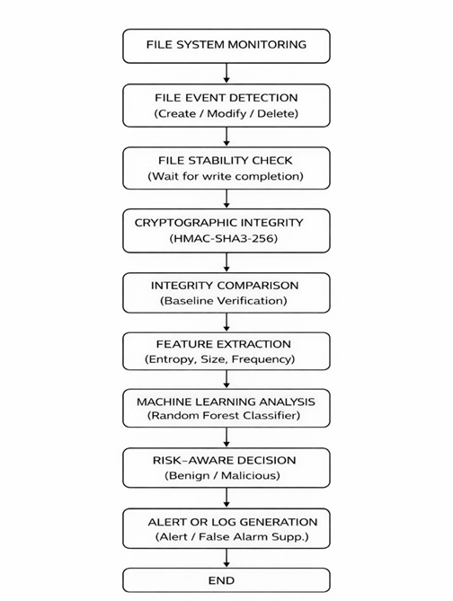
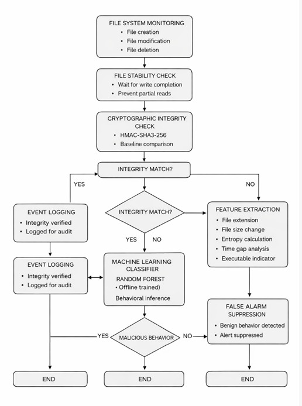

# 🛡 Intelligent File Integrity Monitoring Through Hybrid Cryptographic Verification and Pre-trained Machine Learning

An intelligent File Integrity Monitoring (FIM) system that combines HMAC-SHA3-256 cryptographic verification with a Random Forest machine learning classifier to distinguish legitimate file modifications from malicious tampering and reduce false alarms.
<p align="center">


</p>

---

## 📖 Project Overview

Traditional File Integrity Monitoring (FIM) systems detect file modifications using cryptographic hash verification. While effective at identifying changes, they cannot distinguish between legitimate file updates and malicious tampering, resulting in excessive false alarms and alert fatigue for security administrators.

This project presents an **Intelligent File Integrity Monitoring (FIM)** system that combines **HMAC-SHA3-256 cryptographic verification** with a **Random Forest–based machine learning classifier**. The system continuously monitors file system events, verifies file integrity, extracts behavioral features from modified files, and classifies changes as **benign** or **malicious**, enabling more accurate and context-aware threat detection.

Developed as an IEEE conference project, this hybrid approach improves the practicality of traditional FIM solutions by reducing false positives while maintaining high detection accuracy.

---
# 🚨 Problem Statement

Conventional File Integrity Monitoring (FIM) systems rely solely on cryptographic hashes to detect file modifications. Although highly reliable for identifying integrity violations, these systems generate alerts for **every file change**, regardless of whether the modification is legitimate or malicious.

In real-world environments, software updates, operating system patches, application installations, and routine user activities frequently modify files. Since traditional FIM solutions cannot distinguish these benign changes from genuine cyberattacks, security teams experience:

- High false alarm rates
- Alert fatigue
- Increased investigation time
- Reduced operational efficiency

There is therefore a need for an intelligent monitoring framework capable of combining strong cryptographic verification with contextual analysis to determine the actual risk associated with each file modification.

---
## 💡 Proposed Solution

This project introduces a hybrid File Integrity Monitoring framework that combines **cryptographic integrity verification** with **machine learning–based behavioral analysis**.

The workflow consists of the following stages:

1. Real-time monitoring of file system events using Watchdog.
2. Detection of file creation and modification events.
3. Verification of file integrity using HMAC-SHA3-256.
4. Feature extraction from the modified file and its metadata.
5. Risk prediction using a pre-trained Random Forest classifier.
6. Generation of a final decision indicating whether the modification is benign or malicious.

Unlike traditional FIM systems that generate alerts solely based on hash mismatches, the proposed framework incorporates contextual intelligence to significantly reduce unnecessary alerts while maintaining strong security.

---

## ✨ Features

- Real-time file monitoring using the Watchdog library.
- File integrity verification using HMAC-SHA3-256.
- Automatic baseline hash generation and comparison.
- Feature extraction from monitored file events.
- Random Forest–based classification of file modifications.
- Risk-based decision engine for identifying benign and malicious changes.
- Structured event logging for auditing and analysis.
- Modular architecture for easy maintenance and extension.

  ---

## 🏗️ System Workflow

The project follows the workflow shown below:

1. The file monitoring module continuously watches the selected directory for file creation, modification, and deletion events.
2. When a file event is detected, the cryptographic module computes the HMAC-SHA3-256 hash and compares it with the stored baseline hash.
3. Relevant features are extracted from the file event and cryptographic results.
4. The extracted features are passed to the pre-trained Random Forest model for classification.
5. The risk decision module combines the integrity verification result and machine learning prediction to determine whether the file modification is **Benign** or **Malicious**.
6. The final decision and event details are logged for auditing and analysis.

---
### System Workflow Diagram

<p align="center">
  
</p>
## 📁 Project Structure

```text
fim-secure-ml/
│
├── common/                # Feature engineering and risk decision modules
├── crypto_engine/         # HMAC-SHA3-256 integrity verification
├── ml/                    # Machine learning dataset, model, training and prediction
├── ui/                    # User interface components
├── file_monitor.py        # Main application for real-time file monitoring
├── ml_integration_demo.py # Demonstrates the integrated monitoring workflow
├── requirements.txt       # Project dependencies
└── README.md              # Project documentation
```
---
---

## 🏛️ Detailed System Architecture

The following diagram illustrates the complete workflow of the proposed hybrid File Integrity Monitoring framework.

<p align="center">
  
</p>

## 💻 Technology Stack

| Category | Technologies |
|----------|--------------|
| Programming Language | Python |
| File Monitoring | Watchdog |
| Cryptography | HMAC-SHA3-256 |
| Machine Learning | Random Forest (Scikit-learn) |
| Data Processing | Pandas, NumPy |
| Model Serialization | Joblib |
| Data Storage | JSON, CSV |

---

---

## 📊 Dataset

A custom dataset was generated through controlled file system operations by simulating both legitimate file updates and unauthorized file modifications.

### Dataset Details

- **Dataset Type:** Self-generated
- **Total Samples:** 1,000
- **Benign Samples:** 937
- **Malicious Samples:** 63
- **Format:** CSV
- **Model:** Random Forest Classifier

Each record represents a file integrity verification event and includes features extracted from the monitored file and cryptographic verification process.

### Features Used

- Hash Change Flag
- File Size Delta
- Time Delta Between Checks
- Integrity Status
- Frequency of Modification

The dataset was used to train and evaluate the Random Forest model for classifying file modifications as **Benign** or **Malicious**.

---

## 📈 Results

The proposed hybrid File Integrity Monitoring framework combines HMAC-SHA3-256 cryptographic verification with a Random Forest classifier to accurately distinguish benign file updates from malicious modifications.

### Performance

| Metric | Value |
|---------|-------|
| Accuracy | **99.5%** |
| F1-Score | **96%** |

The hybrid approach significantly reduced false alarms compared to conventional File Integrity Monitoring systems while maintaining high detection accuracy.

---

## 📂 Repository

```text
Repository: fim-secure-ml

Main Modules:
• File Monitoring
• Cryptographic Integrity Verification
• Machine Learning Classification
• Risk Decision Engine
```

